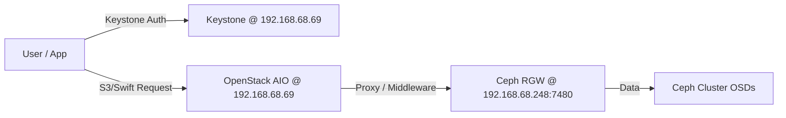

#  Comprehensive Practical Guide: Integrating Ceph RGW with Kolla-Ansible OpenStack (All-in-One)

## 📑 Table of Contents

1.  **Introduction & Architecture Overview**
2.  **Prerequisites & Environment Validation**
3.  **Ceph Side Configuration: Preparing RGW for OpenStack**
4.  **OpenStack Side Configuration: Kolla-Ansible Setup**
5.  **Deployment & Verification Steps**
6.  **Operational Guide: Using Swift & S3 Interfaces in OpenStack**
7.  **Troubleshooting Common Integration Issues**
8.  **Maintenance, Monitoring, and Cleanup**

---

## 1. Introduction & Architecture Overview

### The Goal
You have a fully functional **Single-Node All-in-One (AIO) OpenStack** deployment using **Kolla-Ansible** on IP `192.168.68.69`. Your Ceph Cluster (5 nodes, Admin IP `192.168.68.248`) is already integrated for Block Storage (Cinder), Image Service (Glance), and Backup.

Now, you want to enable **Object Storage** capabilities within OpenStack by connecting it to the existing **Ceph RADOS Gateway (RGW)**. This allows OpenStack users to use:
1.  **Swift API:** For native OpenStack Object Storage operations (used by Horizon Dashboard).
2.  **S3 API:** For Amazon S3-compatible applications (used by CLI tools like `mc`, `s3cmd`, or custom apps).

### Why Integrate RGW with OpenStack?
*   **Unified Management:** Users can manage object storage via the OpenStack Horizon Dashboard or CLI (`openstack` command).
*   **Identity Integration:** Uses Keystone for authentication, so users don’t need separate Ceph credentials.
*   **Cost Efficiency:** Leverages existing Ceph hardware without adding new Swift nodes.

### Architecture Flow


> **Note:** Since you are using Kolla-Ansible, we will configure OpenStack services (Swift Proxy, Keystone Middleware) to talk to the external Ceph RGW endpoints. We do **not** deploy internal Swift containers; instead, we point OpenStack to the external Ceph RGW.

---

## 2. Prerequisites & Environment Validation

Before starting, ensure your environment is ready.

### Infrastructure Details
*   **OpenStack Node (AIO):** `192.168.68.69`
    *   Deployment Tool: Kolla-Ansible
    *   Status: Running (Cinder/Glance already integrated with Ceph)
*   **Ceph Cluster:**
    *   Nodes: 5
    *   Admin/Mon Node IP: `192.168.68.248`
    *   RGW Service: Running on Port `7480` (Verified in previous steps)
    *   RGW Realm/Zone: `default`

### Step 2.1: Verify Ceph RGW Connectivity from OpenStack Node
Log in to your OpenStack AIO node (`192.168.68.69`) and test connectivity to Ceph RGW.

```bash
# Install mc if not present
wget https://dl.min.io/client/mc/release/linux-amd64/mc
chmod +x mc
sudo mv mc /usr/local/bin/

# Test connection using the keys created earlier
mc alias set ceph-test http://192.168.68.248:7480 <ACCESS_KEY> <SECRET_KEY>
mc ls ceph-test
```
If this works, network connectivity is confirmed.

### Step 2.2: Verify Kolla-Ansible Directory Structure
Ensure you have access to the Kolla-Ansible configuration directory on the OpenStack node.

```bash
cd /etc/kolla
ls -l globals.yml passwords.yml
```

---

## 3. Ceph Side Configuration: Preparing RGW for OpenStack

On the **Ceph Admin Node** (`192.168.68.248`), we need to prepare specific users and pools that OpenStack will use.

### Step 3.1: Create Dedicated Pools for Swift/S3
Although RGW can use default pools, it’s best practice to create dedicated pools for OpenStack integration.

```bash
# Create pools for RGW data, metadata, and logs
ceph osd pool create .rgw.root 8 8
ceph osd pool create default.rgw.control 8 8
ceph osd pool create default.rgw.meta 8 8
ceph osd pool create default.rgw.log 8 8
ceph osd pool create default.rgw.buckets.index 8 8
ceph osd pool create default.rgw.buckets.data 8 8

# Initialize RGW system (if not already done)
radosgw-admin realm create --rgw-realm=default --default
radosgw-admin zonegroup create --rgw-zonegroup=default --master --default
radosgw-admin zone create --rgw-zonegroup=default --rgw-zone=default --master --default
```

### Step 3.2: Create OpenStack-Specific RGW Users
OpenStack needs two types of access:
1.  **Swift User:** For Horizon Dashboard and Swift CLI.
2.  **S3 User:** For S3-compatible APIs.

#### A. Create Swift User
```bash
radosgw-admin user create --uid=swift-user --display-name="Swift User" --system
```
*Save the `access_key` and `secret_key` from the output.*

#### B. Create S3 User (Optional, if different from Swift)
Usually, the same user can be used for both, but let's create a dedicated one for clarity.
```bash
radosgw-admin user create --uid=s3-user --display-name="S3 User"
```
*Save the `access_key` and `secret_key`.*

### Step 3.3: Enable Subuser for Swift (Important)
For Swift API compatibility, the user needs a subuser.

```bash
radosgw-admin subuser create --uid=swift-user --subuser=swift-user:swift --access=full
```

### Step 3.4: Configure RGW for Keystone Authentication (Middleware)
To allow OpenStack users to access RGW using their Keystone tokens, we must configure RGW to trust Keystone.

1.  **Get Keystone Endpoint URL:**
    On OpenStack Node (`192.168.68.69`):
    ```bash
    openstack endpoint list --service identity --interface public
    ```
    *Note the URL, e.g., `http://192.168.68.69:5000/v3`*

2.  **Create Keystone User in Ceph:**
    On Ceph Admin Node:
    ```bash
    # Create a user for Keystone integration
    radosgw-admin user create --uid=keystone-user --display-name="Keystone User" --system
    
    # Save the access_key and secret_key
    ```

3.  **Configure Ceph Config Map:**
    Update the Ceph configuration to point to Keystone.
    
    ```bash
    ceph config set client.rgw rgw_keystone_url http://192.168.68.69:5000/v3
    ceph config set client.rgw rgw_keystone_admin_user keystone-user
    ceph config set client.rgw rgw_keystone_admin_password <KEYSTONE_USER_SECRET_KEY>
    ceph config set client.rgw rgw_keystone_admin_domain default
    ceph config set client.rgw rgw_keystone_api_version 3
    ceph config set client.rgw rgw_keystone_accepted_roles admin,member,_member_,reader
    ceph config set client.rgw rgw_keystone_token_cache_size 10000
    ceph config set client.rgw rgw_keystone_revocation_interval 300
    ceph config set client.rgw rgw_s3_auth_use_keystone true
    ceph config set client.rgw rgw_swift_account_in_url true
    ```

4.  **Restart RGW Services:**
    ```bash
    ceph orch restart rgw.my-rgw
    ```

---

## 4. OpenStack Side Configuration: Kolla-Ansible Setup

On the **OpenStack AIO Node** (`192.168.68.69`), we need to configure Kolla-Ansible to use the external Ceph RGW instead of deploying internal Swift containers.

### Step 4.1: Edit `globals.yml`

Open `/etc/kolla/globals.yml` and add/modify the following settings.

```yaml
# --- Ceph RGW Integration ---

# Enable Swift service in Kolla (this deploys the Swift Proxy which acts as a middleware)
enable_swift: "yes"

# Specify that we are using external Ceph RGW
swift_store_auth_address: "http://192.168.68.248:7480/auth/v1.0"
swift_store_user: "swift-user:swift"
swift_store_key: "<SWIFT_USER_SECRET_KEY_FROM_STEP_3.2>"
swift_store_container: "glance-images" # For Glance integration if needed

# Configure Swift Proxy to point to Ceph RGW
# We disable internal Swift storage backends and use external
swift_enable_proxy_server: "yes"
swift_enable_account_server: "no"
swift_enable_container_server: "no"
swift_enable_object_server: "no"

# Keystone Middleware Configuration for Swift
swift_keystone_enabled: "yes"
swift_keystone_version: "v3"
swift_keystone_auth_uri: "http://192.168.68.69:5000/v3"
swift_keystone_identity_uri: "http://192.168.68.69:5000/v3"
swift_keystone_admin_user: "admin"
swift_keystone_admin_password: "{{ kolla_internal_vip_address }}" # Or actual admin password from passwords.yml
swift_keystone_admin_project_name: "admin"
swift_keystone_admin_domain_name: "Default"

# S3 API Configuration (for EC2/S3 compatibility)
enable_s3api: "yes"
s3api_host: "192.168.68.248"
s3api_port: "7480"
s3api_protocol: "http"
```

> **⚠️ Important Note:** In modern Kolla-Ansible versions, direct integration with external RGW often involves configuring the **Swift Proxy** as a pass-through or using **Keystone Middleware**. If you are using a newer version (Wallaby+), you might need to configure `swift-proxy-server` to forward requests to RGW.

### Alternative Approach: Direct Keystone-RGW Trust (Recommended)
Instead of deploying Swift Proxy containers, you can simply configure OpenStack clients to talk directly to RGW, relying on Keystone for auth. This is cleaner.

1.  **Disable Internal Swift:**
    In `globals.yml`:
    ```yaml
    enable_swift: "no"
    ```

2.  **Configure OpenStack Clients:**
    Users will use the `openstack` CLI or Horizon, but we need to tell Horizon where the Object Storage endpoint is.

3.  **Create Keystone Endpoints for Object Store:**
    On OpenStack Node:
    ```bash
    # Create Object Store Service
    openstack service create --name swift --description "OpenStack Object Storage" object-store

    # Create Endpoints pointing to Ceph RGW
    openstack endpoint create --region RegionOne object-store public http://192.168.68.248:7480/swift/v1/AUTH_%(project_id)s
    openstack endpoint create --region RegionOne object-store internal http://192.168.68.248:7480/swift/v1/AUTH_%(project_id)s
    openstack endpoint create --region RegionOne object-store admin http://192.168.68.248:7480/swift/v1/AUTH_%(project_id)s
    ```

4.  **Configure Horizon (Dashboard):**
    Edit `/etc/kolla/horizon/local_settings` (or via `globals.yml` if supported):
    ```python
    SWIFT_ENABLED = True
    OPENSTACK_API_VERSIONS = {
        "object-store": 1,
    }
    ```

### Step 4.2: Update `passwords.yml` (If using Swift Proxy)
If you enabled `enable_swift: "yes"`, ensure the Swift passwords are set.
```bash
kolla-genpwd
```

---

## 5. Deployment & Verification Steps

### Step 5.1: Reconfigure Kolla-Ansible
Run the Kolla-Ansible deployment command to apply changes.

```bash
# If you changed globals.yml
kolla-ansible -i ./all-in-one reconfigure

# Or full deploy if necessary
kolla-ansible -i ./all-in-one deploy
```

### Step 5.2: Verify Keystone Endpoints
Check if the Object Store endpoints are correctly registered.

```bash
openstack endpoint list --service object-store
```
Expected Output:
| ID | Region | Service Name | Service Type | Enabled | Interface | URL |
| :--- | :--- | :--- | :--- | :--- | :--- | :--- |
| ... | RegionOne | swift | object-store | True | public | http://192.168.68.248:7480/swift/v1/AUTH_%(project_id)s |

### Step 5.3: Test Swift Access via OpenStack CLI
Log in as an OpenStack user (e.g., `demo`) and test object storage operations.

```bash
# Source the demo user credentials
source /etc/kolla/admin-openrc.sh 
# Or source demo user rc file if available

# Create a container
openstack container create my-test-container

# Upload a file
echo "Hello OpenStack-Ceph" > test.txt
openstack object create my-test-container test.txt

# List objects
openstack object list my-test-container

# Download object
openstack object save my-test-container test.txt --file downloaded_test.txt
```

### Step 5.4: Test S3 Access via OpenStack Credentials
OpenStack provides EC2 credentials for S3 compatibility.

1.  **Generate EC2 Credentials:**
    ```bash
    openstack ec2 credentials create
    ```
    *Save the `access` and `secret` keys.*

2.  **Test with MinIO Client (`mc`):**
    ```bash
    mc alias set openstack-s3 http://192.168.68.248:7480 <EC2_ACCESS_KEY> <EC2_SECRET_KEY>
    mc ls openstack-s3
    mc mb openstack-s3/my-s3-bucket
    mc cp test.txt openstack-s3/my-s3-bucket/
    ```

---

## 6. Operational Guide: Using Swift & S3 Interfaces in OpenStack

### Scenario 1: Uploading VM Backups to Object Storage
You can configure Cinder Backup to use Swift (RGW) as the backend.

1.  **Edit `/etc/kolla/cinder-backup/cinder-backup.conf`:**
    ```ini
    [DEFAULT]
    backup_driver = cinder.backup.drivers.swift.SwiftBackupDriver
    backup_swift_url = http://192.168.68.248:7480/swift/v1
    backup_swift_auth = per_user
    backup_swift_user = <SWIFT_USER>
    backup_swift_key = <SWIFT_KEY>
    ```

2.  **Restart Cinder Backup:**
    ```bash
    docker restart cinder_backup
    ```

3.  **Create Backup:**
    ```bash
    openstack volume backup create --container my-backup-container <volume-id>
    ```

### Scenario 2: Storing Glance Images in RGW
If you want Glance to store images in RGW instead of RBD:

1.  **Edit `/etc/kolla/glance-api/glance-api.conf`:**
    ```ini
    [glance_store]
    stores = swift
    default_store = swift
    swift_store_auth_address = http://192.168.68.248:7480/auth/v1.0
    swift_store_user = service:glance
    swift_store_key = <GLANCE_SWIFT_KEY>
    swift_store_container = glance-images
    swift_store_create_container_on_put = True
    ```

2.  **Restart Glance:**
    ```bash
    docker restart glance_api
    ```

---

## 7. Troubleshooting Common Integration Issues

### Issue 1: `401 Unauthorized` when accessing Swift
*   **Cause:** Keystone token mismatch or expired.
*   **Fix:** Ensure `rgw_keystone_url` in Ceph config is correct and reachable from Ceph nodes. Check firewall port `5000` (Keystone) on OpenStack node.

### Issue 2: `404 Not Found` for Containers
*   **Cause:** Incorrect endpoint URL format.
*   **Fix:** Ensure the endpoint URL includes `AUTH_%(project_id)s` for multi-tenancy isolation.
    *   Correct: `http://192.168.68.248:7480/swift/v1/AUTH_%(project_id)s`
    *   Incorrect: `http://192.168.68.248:7480/swift/v1`

### Issue 3: Slow Performance
*   **Cause:** Network latency between OpenStack and Ceph.
*   **Fix:** Ensure both clusters are on a high-speed network (10GbE+). Check MTU settings (Jumbo Frames recommended).

### Issue 4: S3 Credentials Not Working
*   **Cause:** EC2 credentials not generated or mapped.
*   **Fix:** Always generate fresh EC2 credentials via `openstack ec2 credentials create` for S3 access. Do not use standard OpenStack username/password for S3 API.

---

## 8. Maintenance, Monitoring, and Cleanup

### Monitoring
*   **Ceph Side:** Use `ceph dashboard` to monitor RGW request rates.
*   **OpenStack Side:** Use Prometheus/Grafana to monitor Swift API calls forwarded to RGW.

### Routine Maintenance
*   **Rotate Keys:** Periodically rotate Swift/S3 user keys in Ceph and update OpenStack configs.
    ```bash
    radosgw-admin key rm --uid=swift-user --key-type=swift
    radosgw-admin key create --uid=swift-user --key-type=swift --gen-secret
    ```
*   **Check Logs:**
    *   Ceph RGW Logs: `/var/log/ceph/<cluster-id>/rgw.<node>.log`
    *   OpenStack Swift Proxy Logs: `docker logs swift_proxy`

### Cleanup (Unintegration)
If you need to remove the integration:

1.  **Delete Endpoints:**
    ```bash
    openstack endpoint delete <endpoint-id>
    openstack service delete <service-id>
    ```
2.  **Remove Ceph Users:**
    ```bash
    radosgw-admin user rm --uid=swift-user
    radosgw-admin user rm --uid=s3-user
    ```
3.  **Revert Kolla Config:**
    Set `enable_swift: "no"` in `globals.yml` and reconfigure.

---

## 💡 Final Best Practices Summary

1.  **Use Keystone for Auth:** Always configure RGW to trust Keystone (`rgw_s3_auth_use_keystone true`) to avoid managing separate user databases.
2.  **Endpoint Precision:** Ensure OpenStack endpoints for Object Store exactly match the RGW path structure (`/swift/v1/AUTH_%(project_id)s`).
3.  **Network Security:** Restrict access to RGW ports (`7480`) only from OpenStack nodes and trusted clients using Firewalls.
4.  **Backup Strategy:** Use Cinder Backup with Swift driver to leverage RGW for cost-effective volume backups.
5.  **Documentation:** Keep a record of all generated Access/Secret keys in a secure vault (e.g., HashiCorp Vault) rather than plain text files.

This guide provides a robust, production-ready method to integrate Ceph RGW with Kolla-Ansible OpenStack, leveraging the strengths of both systems for a unified cloud infrastructure.